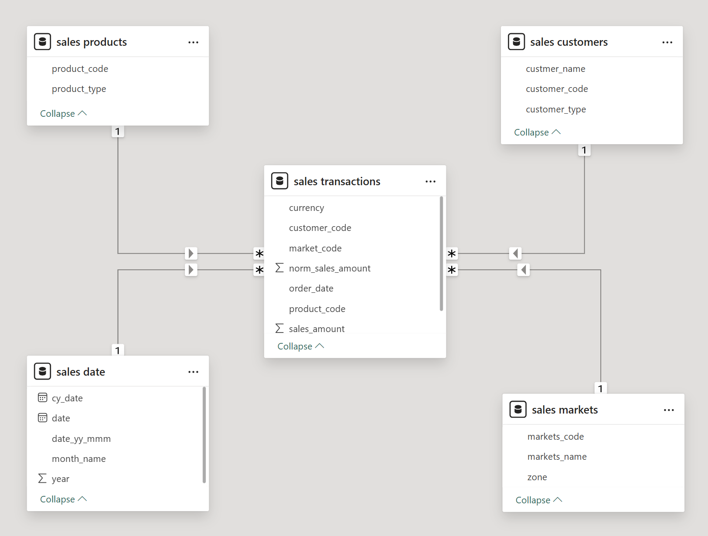
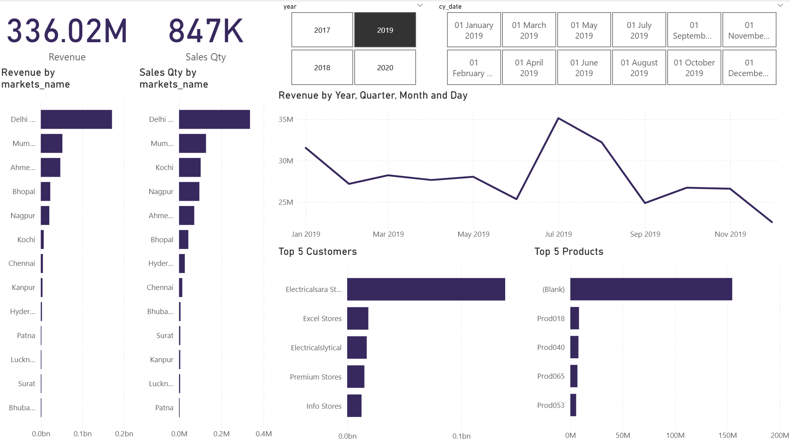

# Sales Insights Analytics

### 📌 Project Overview

The Sales Insights Analytics project focuses on analyzing company sales data to uncover meaningful trends, improve decision-making, and provide a clear view of performance.
Using MySQL, Power Query, and Power BI, I transformed raw sales data into an interactive dashboard with actionable insights.

## 🔍 Workflow
**1. Data Source**
  - Started with a SQL dump file containing sales transactions.

**2. Data Analysis in MySQL**
  - Imported the SQL dump into MySQL Server.
  - Performed queries to explore and validate the data.

**3. Data Import & Cleaning**
  - Connected MySQL Server with Power BI.
  - Cleaned and transformed data using Power Query.

**4. Data Modeling & Dashboard**
  - Created relationships and measures in Power BI.
  - Built an interactive dashboard with filters, KPIs, and visualizations.

## Database Schema

## 🛠️ Tech Stack
- **Database:** MySQL
- **Data Cleaning:** Power Query
- **Visualization & Reporting:** Power BI

## 📸 Dashboard Preview

## 📊 Key Insights
- Identified revenue trends across regions and customer segments.
- Highlighted top-performing products and categories.
- Provided KPIs for sales growth and profitability.
